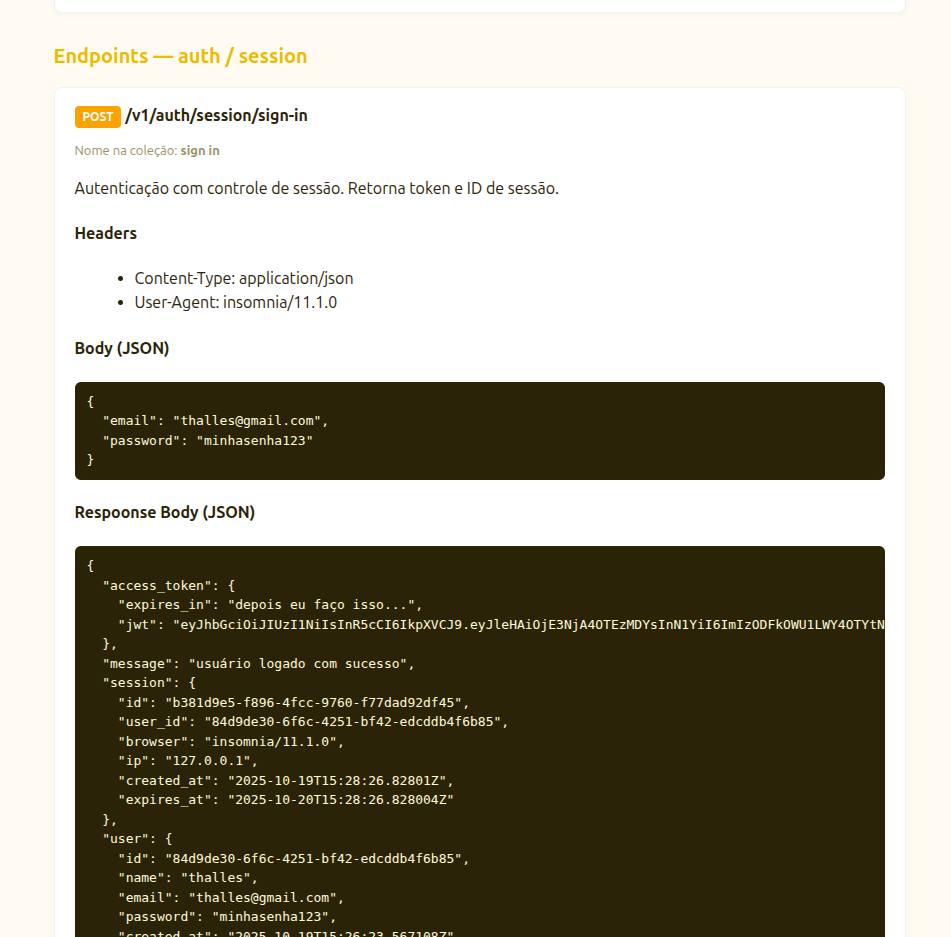

# Jwt com sessão - a forma correta de gerar token de autenticação
É muito comum ver autenticação JWT pura em projetos, mas existe um problema que poucos mencionam: o controle da validação do token. Uma vez assinado, o token continua válido até sua expiração — ou, em casos bem raros, até a chave usada para gerá-lo expirar.

Esse comportamento do JWT cria uma falha importante em situações de vazamento do token ou da senha. Depois que o invasor faz login, ele passa a ter acesso aos recursos da vítima e, mesmo que a senha seja alterada, isso não terá efeito até o token expirar.

Alguns podem pensar que usar um refresh token resolve o problema, mas dependendo da implementação, se não houver uma flag indicando que a senha foi alterada, nada acontecerá — e pior: o atacante poderá manter acesso indefinidamente, gerando novos tokens.


Há várias formas de resolver esse problema. Uma delas é usar cookies de sessão, ou uma alternativa que combina as duas abordagens — e é essa que vou apresentar. Vale lembrar que esta aplicação foi desenvolvida em Go, mas a ideia funciona em qualquer linguagem ou framework.

## O que é o JWT
O JWT (JSON Web Token) é um padrão para transmitir informações seguras entre duas partes em formato JSON. Ele é muito usado para autenticação e autorização, permitindo que o servidor verifique a identidade do usuário sem precisar manter sessão. Um JWT é composto por três partes: cabeçalho, que indica o tipo de token e o algoritmo de assinatura; payload, que contém os dados como ID do usuário e permissões; e assinatura, que garante a integridade do token. Após o login, o servidor envia o token ao cliente, que o envia em requisições subsequentes para acessar recursos protegidos de forma segura e eficiente.

## O problema ao gerar o token JWT da forma tradicional

Essa função é responsável por gerar o token. Ela é bem simples: recebe um payload que será usado futuramente para identificar quem está acessando um recurso.
```go

func GenerateJwt(sub string) (string, error) {
	claims := jwt.MapClaims{
		"sub": sub,
		"exp": time.Now().Add(time.Hour * 1).Unix(), // expires in 1h
	}
	token := jwt.NewWithClaims(jwt.SigningMethodHS256, claims)
	return token.SignedString(config.JWT_SEC_KEY)
}
```

função é equivalente a essa no js
```js
function generateJwt(sub) {
  const payload = {
    sub,
    exp: Math.floor(Date.now() / 1000) + 60 * 60 // expira em 1 hora
  };

  const token = jwt.sign(payload, config.JWT_SEC_KEY, { algorithm: 'HS256' });
  return token;
}
```

O problema é que muitos desenvolvedores usam o ID do usuário para isso. Pode parecer estranho, já que realmente precisamos identificar quem é o usuário, mas fazer isso é justamente o que nos impede de invalidar o token facilmente.

Uma forma de resolver esse problema é adicionando um intermediador entre o token e o usuário, que chamaremos de sessão. Assim, quando não precisarmos mais dessa sessão, basta deletá-la — e, consequentemente, o token será invalidado sem termos que deletar o usário .


A sessão pode ser modelada da seguinte forma, isto é algo pessoal, faça da forma que achar mais conveniente.
```sql
CREATE TABLE IF NOT EXISTS "sessions" (
    id VARCHAR(40) PRIMARY KEY,
    user_id VARCHAR NOT NULL,
    browser TEXT,
    ip TEXT,
    created_at TIMESTAMP WITH TIME ZONE DEFAULT now(),
    expires_at TIMESTAMP WITH TIME ZONE NOT NULL,
    CONSTRAINT fk_user FOREIGN KEY(user_id) REFERENCES users(id) ON DELETE CASCADE
);

CREATE INDEX idx_sessions_user_id ON sessions(user_id);
```

Perceba que, com a sessão, posso salvar dados como navegador (browser) e IP, o que ajuda o usuário a identificar o dispositivo e ter uma noção de localização. Na hora de gerar o token, em vez de assinar com o ID do usuário, assinamos com o ID da sessão.

Obs.: localizações obtidas por IP podem ser mascaradas, portanto não representam um endereço real — mas são melhores do que nada.


### Assinando o token com a sessão
Antes de gerar o token de autenticação, criamos uma sessão e a salvamos em um banco de dados. Neste exemplo, utilizei o PostgreSQL como banco, mas você pode trocar por outro que tenha leitura/escrita mais rápida, sem problemas.

No entanto, neste caso específico, não é necessário: com poucos registros e uma boa indexação, não haverá problemas de performance.

```go
session := models.Session{
		ID:        uuid.New().String(),
		UserID:    user.ID,
		Browser:   &browser,
		IP:        &ip,
		CreatedAt: time.Now(),
		ExpiresAt: sessionExpiresAt,
	}

	sessionCreated, err := sessionRepository.Create(&session)
	if err != nil {
		logger.Error.Printf("internal server error when create session: error: %s", err.Error())
		c.Status(http.StatusInternalServerError).JSON(fiber.Map{
			"message": "erro interno no servidor ao criar a sessão",
			"error":   err.Error(),
		})
	}

	jwt, err := jwt.GenerateJwt(session.ID)
	if err != nil {
		logger.Error.Printf("internal server error when generate jwt. error: %s", err.Error())
		return c.Status(http.StatusInternalServerError).JSON(fiber.Map{
			"message": "erro interno no servidor ao tentar gerar o token de acesso",
			"error":   err.Error(),
		})
	}
```

equivalente no javascript como:
```js
const session = {
  id: "uuid-gerado-aqui",
  userId: user.id,
  browser: browser,
  ip: ip,
  createdAt: new Date(),
  expiresAt: sessionExpiresAt
};

const sessionCreated = sessionRepository.create(session);

const token = generateJwt(session.id); // assina o id da sessção no token
```

Dessa forma, o token fica dependente da sessão e não do usuário. Além de armazenar informações do usuário, a sessão também guarda dados importantes de autenticação.

### Middleware - validando a sessão
No middleware de autenticação, consultamos no banco os dados da sessão, verificando se ela existe e se é válida (ou seja, se não expirou).

A sessão contém o ID do usuário, que será usado para validar se ele está autorizado a fazer a requisição, e o adicionamos ao contexto para que a requisição possa prosseguir.

```go
func JwtSessionMiddleware(c *fiber.Ctx) error {
	//... Trecho que
  // 1 - pega o token do header.
  // 2 - extrai o token sem o Bearer
  // 3 - verifica se o token é válido ou não
  // 4 - extrai o id da sessão no token (sub)


	var session models.Session
	if err = sessionRepository.GetByID(sub, &session); err != nil && err != sql.ErrNoRows {
		logger.Error.Printf("internal server error when get session by id %s. error: %s", sub, err.Error())
		return c.Status(http.StatusInternalServerError).JSON(fiber.Map{
			"message": "erro interno no servidor ao tentar buscar a sessão",
			"error":   err.Error(),
		})
	}

	if err == sql.ErrNoRows {
		logger.Warn.Printf("session with id %s no found", sub)
		return c.Status(http.StatusUnauthorized).JSON(fiber.Map{
			"message": "sessão não encontrada",
		})
	}

	if !date.IsNotExpired(session.ExpiresAt) {
		logger.Warn.Printf("session already expired at %s", session.ExpiresAt)
		return c.Status(http.StatusUnauthorized).JSON(fiber.Map{
			"message": "sessão inválida ou expirada",
		})
	}

	c.Locals("userId", session.UserID)
	c.Locals("sessionId", session.ID)

	return c.Next()
}
```

equivalente no javascript
```js
function jwtSessionMiddleware(req, res, next) {
  //... Trecho que
  // 1 - pega o token do header.
  // 2 - extrai o token sem o Bearer
  // 3 - verifica se o token é válido ou não
  // 4 - extrai o id da sessão no token (sub)

  const session = sessionRepository.getById(sub);
  if (!session) return res.status(401).json({ message: "sessão não encontrada" });

  if (new Date(session.expiresAt) < new Date()) {
    return res.status(401).json({ message: "sessão inválida ou expirada" });
  }

  req.userId = session.userId;
  req.sessionId = session.id;

  next();
}
```

### Listando todas as sessões de um usário.

Para listar todas as sessões do usuário, basta fazer uma consulta no banco e retornar os resultados para o usuário.

```go
// GetAllByUserID busca todas as sessões de um usuário e preenche o slice passado como parâmetro
func (r *SessionRepository) GetAllByUserID(userID string, sessions *[]models.Session) error {
	return r.db.Select(sessions, `
		SELECT id, user_id, browser, ip, created_at, expires_at
		FROM sessions
		WHERE user_id = $1
	`, userID)
}
```

Exemplo da resposta da api de listagem de sessão neste projeto
```json
{
	"message": "sessões encontradas com successo",
	"sessions": [
		{
			"id": "dfc90a43-9d7f-4139-bc8d-d0468cd1b2c1",
			"user_id": "84d9de30-6f6c-4251-bf42-edcddb4f6b85",
			"browser": "insomnia/11.1.0",
			"ip": "127.0.0.1",
			"created_at": "2025-10-19T15:26:23.593785Z",
			"expires_at": "2025-10-20T15:26:23.593777Z"
		},
		{
			"id": "7fe6499a-e456-4eee-b231-7c0182087c45",
			"user_id": "84d9de30-6f6c-4251-bf42-edcddb4f6b85",
			"browser": "insomnia/11.1.0",
			"ip": "127.0.0.1",
			"created_at": "2025-10-19T15:26:26.094486Z",
			"expires_at": "2025-10-20T15:26:26.094484Z"
		}
	]
}
```

Para deletar as sessões
```go
// DeleteByID deleta uma sessão pelo ID
func (r *SessionRepository) DeleteByUserId(userId string) error {
	_, err := r.db.Exec(`
		DELETE FROM sessions
		WHERE user_id = $1
	`, userId)
	return err
}
```

Se quiser o handler completo da listagem e deleção das sessões [acesse o arquivo session.go](./src/domain/auth/sessinos.go)

### Deletando todas acessoes quando usário trocar a senha
Uma dica: quando o usuário trocar a senha, delete — ou pergunte se ele deseja deletar — todas as suas sessões. Dessa forma, qualquer pessoa que estiver autenticada perderá o acesso imediatamente após essa ação.

```go
	logger.Info.Printf("deleting all sessions from use with id: %s", user.ID)
	sessionRepository := repositories.NewSessionRepository(db)
	if err = sessionRepository.DeleteByUserId(user.ID); err != nil {
		logger.Error.Printf("internal server error when delete all sessions from user. error: %s", err.Error())
		return c.Status(http.StatusInternalServerError).JSON(fiber.Map{
			"message": "erro interno no sevidor ao deletar todas as sessões de um usuário",
			"error":   err.Error(),
		})
	}
```

## Rodando o projeto

### Requisitos
- [docker com docker compose](https://www.docker.com/)
- [Go](https://go.dev/)

### Configurando as variáveis de ambiente

As variáveis declaradas são de exemplo. Se caso precisar usar um serviço de email para testar, recomendo o [mailtrap](https://mailtrap.io/) que tem o plano gratuito e sandbox de teste.

```env
# Postgers
POSTGRES_USER="postgres"
POSTGRES_PASSWORD="postgres"
DB_HOST="localhost"
POSTGRES_PORT=5432
POSTGRES_DB="jwt_sessions_db"

# Grafana
GRAFANA_INITIAL_USER=admin
GRAFANA_INITIAL_PASSWORD=admin
GRAFANA_LOKI_CONNECTION="http://localhost:3100"

# Mail
MAIL_HOST=""
MAIL_PORT=
MAIL_USER=""
MAIL_PASS=""
```

### Instalando as dependências

```sh
go mod tidy
```

### Rodando o projeto
Para executar o projeto suba os seviços de infra
```sh
docker compose up -d
```

depois rode o arquivo principal, certificando se de o terminal estar na raiz do projeto.
###
```sh
go run main.go
```

## Acessando a documentação da api
A documentação da api está no endpoint raiz do projeto [http://localhost:8080](http://localhost:8080)

